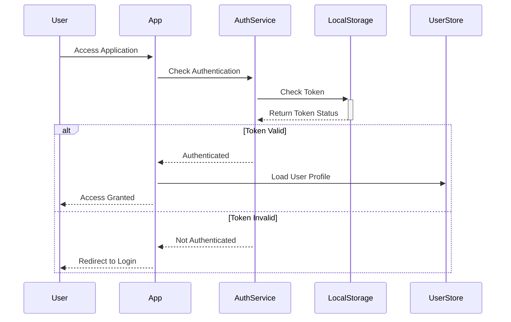
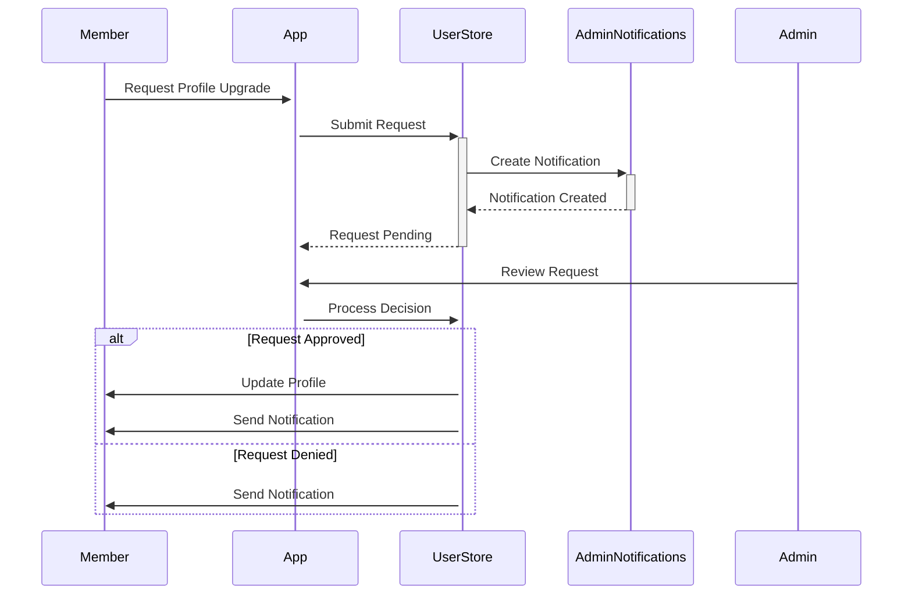

# PWA Explorer Onboarding

A modern Progressive Web App built with Vue 3, Vite, and PWA capabilities. This project serves as a starter template for building production-ready PWAs with modern web technologies.

## 🚀 Features

- ⚡️ Vue 3 + Vite - Lightning fast development
- 📱 PWA Ready - Works offline and can be installed
- 🎨 Tailwind CSS - Utility-first CSS framework
- 🧪 Testing Suite - Unit tests with Vitest and E2E with Cypress
- 📦 Auto-updates - Seamless app updates with service worker
- 🖼️ Responsive Design - Works on all devices
- 🔍 SEO Friendly - Optimized for search engines
- 📸 Screenshots - Desktop and mobile screenshots included

## 🎯 App Functionality & Data Storage

### Core Features
- Space Object Exploration: Browse and learn about various celestial objects
- Interactive Visualization: Dynamic visualization of space objects and their properties
- Favorites System: Save and manage your favorite space objects
- Search Functionality: Search through the cosmic database
- Educational Content: Detailed information about astronomical phenomena

### Data Management
- **Local Storage**: 
  - User preferences
  - Favorite space objects
  - Recent searches
  - Cached data for offline access
  
- **Vuex Store Structure**:
  - `user/`: User preferences and settings
  - `space/`: Space objects and astronomical data
  - `favorites/`: User's saved items
  - `search/`: Search history and results

### API Integration
- NASA Open APIs integration for space data
- Real-time space news and updates
- Dynamic content updates

### Offline Capabilities
- Cached space object data
- Offline browsing of previously viewed content
- Synchronized updates when back online

## 🛠️ Quick Start

### Prerequisites

- Node.js 16.x or later
- npm 7.x or later

### Installation

```bash
# Clone the repository
git clone https://github.com/innerpixel/pwa-Explorer-onboarding.git

# Navigate to project directory
cd pwa-Explorer-onboarding

# Install dependencies
npm install
```

### Development

```bash
# Start development server
npm run start

# Run unit tests
npm run test:unit

# Run E2E tests
npm run test:e2e

# Build for production
npm run build:prod

# Preview production build
npm run preview:prod
```

## 📱 PWA Features

- Offline Support
- Install Prompt
- Auto Updates
- Push Notifications (configurable)
- Responsive Design
- App-like Experience
- Customizable Icons
- Splash Screens

## 🧪 Testing

- Unit Tests: Using Vitest for component and utility testing
- E2E Tests: Using Cypress for end-to-end testing
- PWA Tests: Specific tests for PWA functionality

## 📦 Project Structure

```
├── public/              # Static assets
│   ├── icons/          # PWA icons
│   └── screenshots/    # App screenshots
├── src/                # Source code
│   ├── components/    # Vue components
│   ├── assets/        # Dynamic assets
│   └── styles/        # Global styles
├── tests/              # Test files
│   ├── unit/          # Unit tests
│   └── e2e/           # E2E tests
└── scripts/           # Build and utility scripts
```

## 👥 User Profiles & Authentication

### Profile Types
- **Admin**: Full system access and management capabilities
- **Developer**: Content creation and technical access
- **Contributor**: Content creation and submission
- **Member**: Basic viewing and interaction privileges

### Profile Features

#### Basic User (Member)
- Explore space missions and celestial objects
- Access interactive space explorer interface
- View detailed cosmic phenomena information
- Browse component universe
- Save favorite celestial objects
- Access basic documentation

#### Contributor (Additional)
- Create new space object content
- Submit space-related articles
- Share discoveries
- Add celestial object descriptions
- Participate in community discussions

#### Developer (Additional)
- Create and edit all content
- Access development tools and APIs
- Modify existing descriptions
- Create interactive features
- Access technical documentation

#### Admin (Full Access)
- Manage user accounts and permissions
- Approve/reject profile requests
- Moderate content submissions
- Access admin dashboard
- Manage system configurations

### System Architecture

#### Authentication Setup
```
src/
├── services/
│   └── authService.js    # Authentication logic
├── stores/
│   └── userStore.js      # User state management
├── router/
│   └── index.js         # Route guards & protection
└── views/
    ├── ProfileRequest.vue       # Profile management
    ├── AdminRequestsView.vue    # Admin controls
    └── AdminNotifications.vue   # Admin notifications
```

#### Key Components
1. **User Data**: Stored in `public/data/users.json`
2. **Authentication Service**: Handles login, sessions, and tokens
3. **User Store**: Manages state and privileges
4. **Protected Routes**: Role-based access control
5. **Local Storage**: Session and preference persistence

#### Security Features
- Password hashing with SHA-256
- Token-based authentication
- Route guards for protected content
- Role-based access control
- Secure session management

### Profile Management

#### Access Control
```javascript
// Route protection example
{
  path: '/admin/requests',
  name: 'AdminRequests',
  component: () => import('../views/AdminRequestsView.vue'),
  meta: { requiresAuth: true, requiresAdmin: true }
}
```

#### Profile Initialization
- Automatic loading of user data
- Profile type verification
- Permission setup
- Session restoration

### System Flow

#### Authentication Flow


#### Profile Request Flow


#### Access Control Flow
1. **Initial Access**
   - User attempts to access route
   - Router guard checks authentication
   - Verifies user permissions
   - Grants/denies access based on profile

2. **Profile Upgrade Process**
   - User initiates upgrade request
   - System validates eligibility
   - Admin receives notification
   - Review and approval/denial
   - Profile update if approved

3. **Session Management**
   - Token-based authentication
   - Automatic session restoration
   - Secure token storage
   - Session expiration handling

4. **Content Access Flow**
   ```
   User Request → Auth Check → Permission Check → Content Access
        ↓             ↓              ↓                ↓
    Validate     Check Token    Verify Profile    Grant Access
   ```

5. **Error Handling**
   - Invalid credentials
   - Expired sessions
   - Unauthorized access
   - Profile conflicts
   - Network issues

#### State Management Flow
```javascript
// Example of profile state management
const profileState = {
  current: null,    // Current active profile
  pending: [],      // Pending profile requests
  history: [],      // Profile change history
  permissions: {}   // Active permissions
}
```

## 🤝 Contributing

1. Fork the repository
2. Create your feature branch (`git checkout -b feature/amazing-feature`)
3. Commit your changes (`git commit -m 'Add some amazing feature'`)
4. Push to the branch (`git push origin feature/amazing-feature`)
5. Open a Pull Request

## 📄 License

This project is licensed under the MIT License - see the [LICENSE](LICENSE) file for details.
